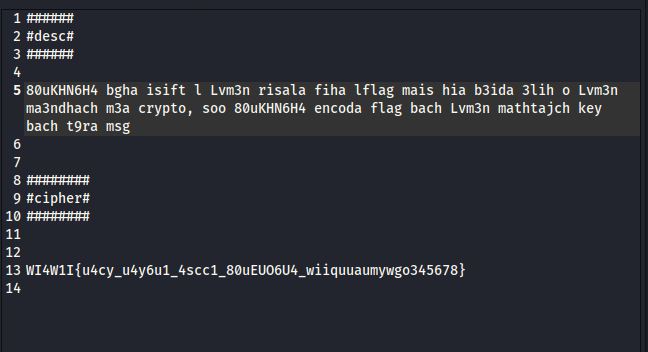

# ST4F1T CHALLENGE
# Welcome to Crypto

First of all, I want to thank the creator of this challenge __ it was fun, and it actually made me realise what I needed to work on in terms of cryptographic fundamentals and pattern recognition

# Discovering the challenge 

At first glance, this cryptography challenge seemed very easy — maybe even too easy. The description was short, the ciphertext looked simple, and I thought, "Alright, a quick decode and I'm done."

Spoiler: It wasn't that easy.

# What i was giving 

# My first attempts

As shown in the picture the challenge is talking about how 80uKHN6H4 want to send a letter to Lvm3n , but Lvm3n is far from him. the challenge also gives us our first hint here __ is that Lvm3n doesn't khnow any thing about cryptography so 80uKHN6H4 encoded the cipher here the challenge gives us our second hint __ " so that lv3n wouldn't need a key to decode the cipher "

# First Attempt 

What i did next is that i tried to decoded it to Leet speak __ " because of the numbers in the cipher " __ which not only was a false track but also wasted so much time. Trying to figure it out, my second  and third attempts were also a failures : trying ROT13 , Ceaser and what ever passed under my hand.

# Glance on how to solve it 

At this point i was on the edge of giving up, just sitting reading the challenge over and over again to see if i had missed something. Then i saw the begining of the flag " WI4W1I " knowing that the flag format must be " ST4F1T " i tried to figure out how can i decode it back, here another probleme showed up.

# Labyrinth

Well, here — due to my lack of experience and knowledge — I thought that transforming "WI4W1I" into "ST4F1T" would be easy. I tried again all of the ROT ciphers, Caesar, substitution — but not a single one worked. At this point, the competition had already finished. But it wasn't about winning anymore — it was about solving this challenge. 

While reading the challenge again, I saw that "W" appears twice in the ciphertext, while in the original plaintext we only have two letters that are repeated — which are "T" (appearing twice in "ST4F1T"). So I deduced that "W" must correspond to both "S" and "F" based on their positions in the cipher.

We know the cipher is encoded, not encrypted. So I started thinking: how can the input of two different letters produce two identical outputs?

And the answer for that question come really fast it was a many-to-one function !

# trying to solve

Digging more deeply into many-to-one algorithms, I found this:
C = (a × p + b) mod 26, where a and b are variables.

Trying to solve this type of function is very hard, which is why we're going to go backwards — meaning we'll start from our plaintext and try to find the cipher, all of this in order to find a and b!

So let's try it:

We have E(p) = (a × p + b) mod 26

And we know:
"ST4F1T" → "WI4W1I"

M going to try to brute-force a and b using a minimal python script:

