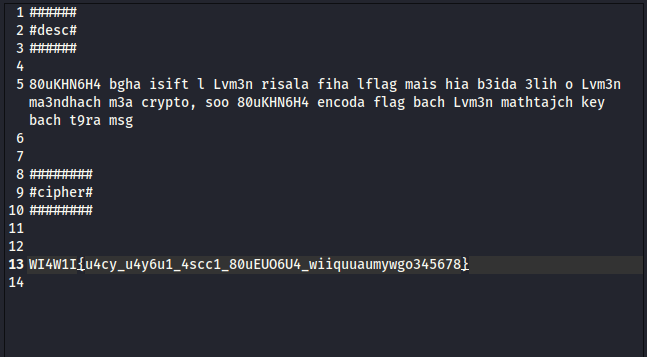

# ST4F1T CHALLENGE
# Welcome to Crypto

First of all, I want to thank the creator of this challenge __ it was fun, and it actually made me realise what I needed to work on in terms of cryptographic fundamentals and pattern recognition

# Discovering the challenge 

At first glance, this cryptography challenge seemed very easy — maybe even too easy. The description was short, the ciphertext looked simple, and I thought, "Alright, a quick decode and I'm done."

Spoiler: It wasn't that easy.

# What i was giving 

# My first attempts

As shown in the picture the challenge is talking about how 80uKHN6H4 want to send a letter to Lvm3n , but Lvm3n is far from him. the challenge also gives us our first hint here __ is that Lvm3n doesn't khnow any thing about cryptography so 80uKHN6H4 encoded the cipher here the challenge gives us our second hint __ " so that lv3n wouldn't need a key to decode the cipher "